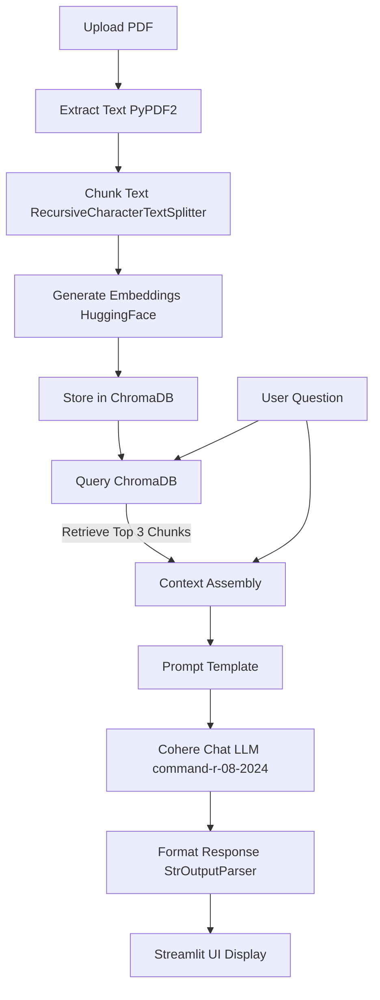

# Cohere RAG App: Conversational PDF Question Answering

A clean, production-ready Retrieval-Augmented Generation (RAG) application built with **Streamlit**, **LangChain**, **Cohere's Chat API**, **ChromaDB**, and **HuggingFace Embeddings**. This project demonstrates how to ingest unstructured document data (PDFs), represent it semantically in a local vector database, and perform precise, context-anchored Q&A.

---

## 🚀 What It Demonstrates & Teaches

This project serves as a practical blueprint for building document-intelligence applications. It demonstrates:

1. **Document Ingestion & Text Extraction**: Parsing unstructured PDF files into raw machine-readable text stream using `PyPDF2`.
2. **Semantic Chunking**: Breaking down document texts into semantic, overlapping chunks (`1000` chars with `200` overlap) using `RecursiveCharacterTextSplitter`. This preserves context across chunk boundaries and respects document structure (paragraphs, sentences).
3. **Local Embedding Generation**: Creating vector representations of text using the lightweight, high-performance open-source model `all-MiniLM-L6-v2` via HuggingFace.
4. **Vector Database Management**: Storing and querying vector embeddings locally in **ChromaDB**, facilitating fast similarity retrieval.
5. **Context-Anchored Prompting**: Structuring system prompts to enforce constraints on the LLM, reducing hallucinations by requiring responses to be based *only* on the retrieved context.
6. **LCEL (LangChain Expression Language)**: Orchestrating the entire RAG pipeline using declarative chains (`retriever | prompt | LLM | parser`).
7. **Cohere Chat V2 Integration**: Harnessing Cohere's state-of-the-art `command-r-08-2024` model, optimized specifically for RAG and citation tasks.

---

## 🛠️ The Architecture Flow



---

## 💻 Tech Stack

*   **UI Framework**: [Streamlit](https://streamlit.io/) (for a fast, interactive user interface)
*   **LLM Provider**: [Cohere Chat API](https://cohere.com/) (using the flagship `command-r-08-2024` model)
*   **RAG Framework**: [LangChain / LangChain Cohere](https://github.com/langchain-ai/langchain)
*   **Vector Database**: [ChromaDB](https://www.trychroma.com/) (local vector database)
*   **Embeddings**: [HuggingFace Embeddings](https://huggingface.co/sentence-transformers/all-MiniLM-L6-v2) (`sentence-transformers/all-MiniLM-L6-v2`)

---

## ⚙️ Installation & Setup

### Requirements
*   Python 3.9 to 3.11 (Python 3.12+ might require custom PyTorch/Chroma binaries depending on your OS)
*   Cohere API Key (Get a trial API key from the [Cohere Dashboard](https://dashboard.cohere.com/))

### 1. Clone the repository
```bash
git clone https://github.com/Gkodkod/cohere-rag.git
cd cohere-rag
```

### 2. Set up a virtual environment
**On Windows:**
```powershell
python -m venv venv
venv\Scripts\activate
```
**On macOS/Linux:**
```bash
python -m venv venv
source venv/bin/activate
```

### 3. Install dependencies
```bash
pip install -r requirements.txt
```

---

## 🎈 Usage

1.  **Launch the Streamlit app**:
    ```bash
    streamlit run app.py
    ```
2. Open your browser and go to `http://localhost:8501`.

3.  **Configure & Ingest**:
    *   Enter your **Cohere API Key** in the sidebar.
    *   Upload your target **PDF file**. The app will automatically chunk the text and construct the local vector index.
4.  **Chat**:
    *   Type your question in the main chat input bar and hit **Get Answer**. The system will retrieve the most relevant sections of the document and query the LLM to generate an answer.

---

## 🔧 Troubleshooting & Optimizations

*   **SQLite3 Version Errors (Linux/Windows)**: ChromaDB requires SQLite >= 3.35.0. On Windows, Python's standard library `sqlite3` is typically up to date. On older Linux distros, `pysqlite3-binary` is automatically imported as a fallback in `app.py`.  Just uncomment it for older Linux distros. It should not be needed for newer ones.
*   **Console Logging Cleanliness**: Heavy model initialization warnings from `transformers` and `torchvision` optional dependencies are programmatically suppressed at the top of `app.py` via Python's `logging` system.
*   **Folder Watcher CPU Overhead**: A custom `.streamlit/config.toml` is included to blacklist the `venv` and `.git` folders from Streamlit's file-watching daemon, saving CPU cycles and preventing watcher timeouts.
